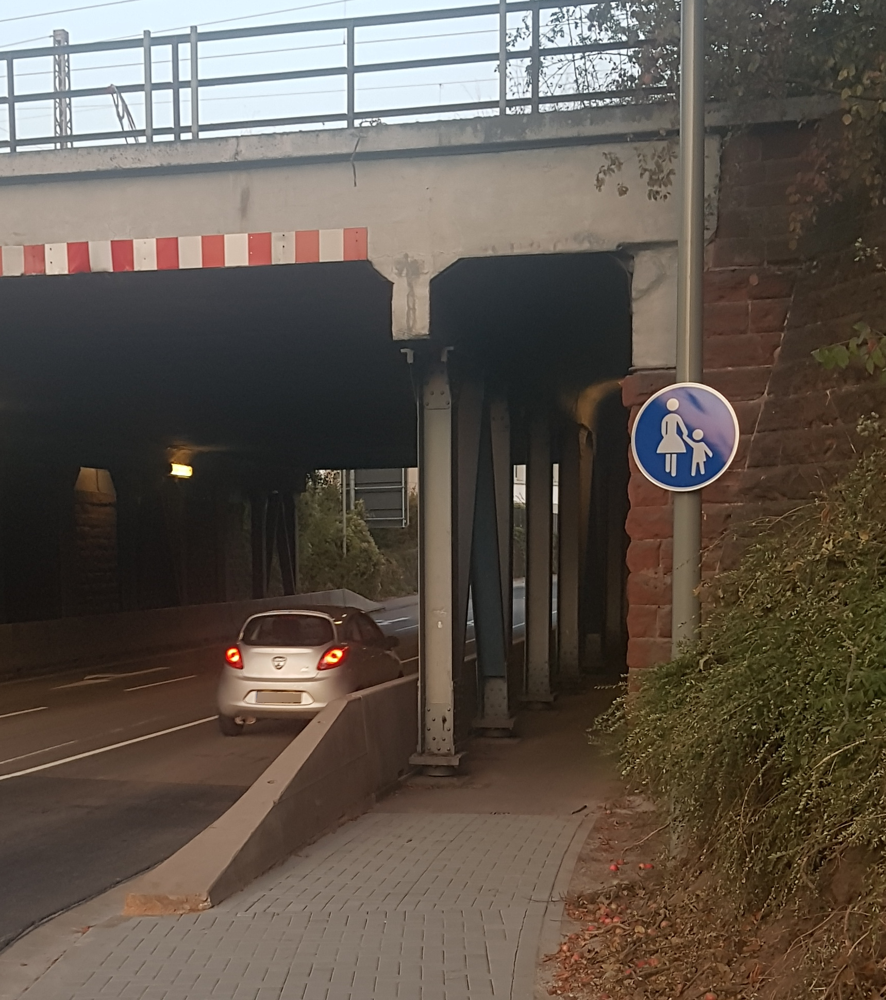

# Hela-Kreuzung

- bis Sommer 2020 als Kreisel
- seit 14.9.2020 Ampelkreuzung
- Induktionsschleifen reagieren nicht auf Radfahrer
- Kombinierte Fuß-/Radampeln (scheinbar sollen Radfahrer auf dem Gehweg statt auf der Fahrbahn fahren)
- Radverkehr wird unter der Bahnunterführung auf die Fahrbahn genötigt

- Ampelpfosten stehen teilweise mitten im abgesenkten Bordstein Bereich (schwierig für Rollstuhlfahrer, Lastenräder oder Rad-Anhänger)
- Keine Grüne Welle für Radfahrer und Fußgänger. Zum Beispiel die Querung der Autobahnabfahrt aus Richtung Luxemburg bzw. Auffahrt in Richtung Saarbrücken (gegenüber Tankstelle Kremer): hier müssen drei Fahrbahnen überquert und mindestens zwei Rotphasen abgewartet werden. Der Radfahrer wird auf die Straße genötigt, dort hat man Grüne Welle und kommt deutlich schneller voran.

