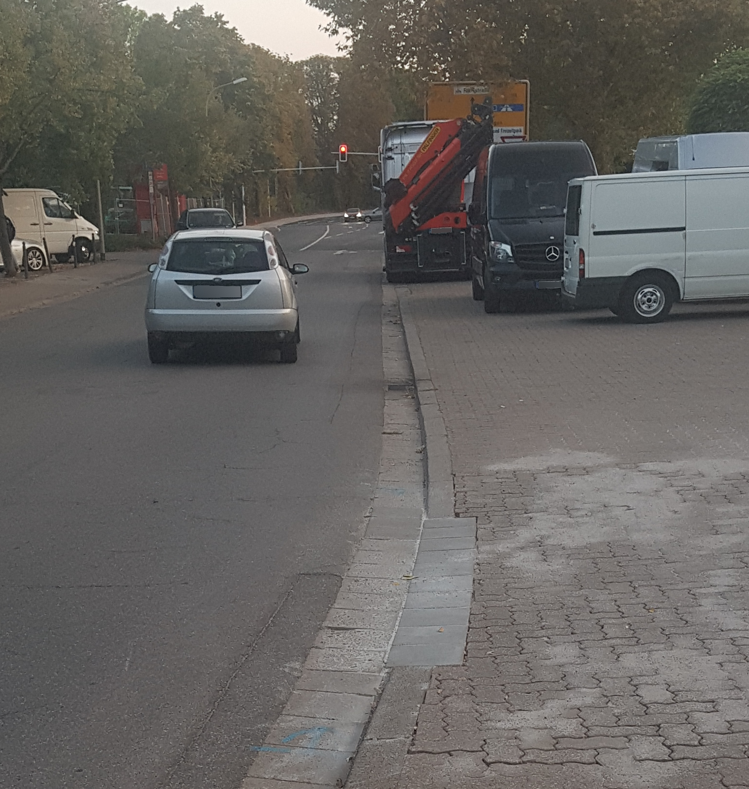

# Stadthalle-Saarradweg (Leinpfad)

Aus der Stadt über die Brauerstraße unter der Bahnunterführung Richtung Stadthalle schliesst sich der Rad-/Fußweg direkt gerade aus an (grün) und mündet in den Saarradweg (Leinpfad).
Problematisch an der Stelle ist, dass der Bordstein in der scharfen Linkskurve nicht abgesenkt ist.
Stattdessen ist der Bordstein unmittelbar vor der Stadthalle abgesenkt (blau), der Sinn erschliesst sich mir hier nicht.
Ich finde es auch seltsam, dass der Bordstein kurz hinter dieser Absenkung, an der Zufahrt zum Stadthallenparkplatz, nicht abgesenkt ist (rot).
Wer kam auf die Idee, Kopfsteinpflaster für einen neuen Rad-/Fußweg zu benutzen?

  
  
  
  

Folgende Szenarien sind also denkbar, jeweils aus der Stadt (Brauerstraße) kommend:
1. Man fährt in der Kurve geradeaus. Falls die entsprechende Ausrüstung fehlt (z. B. Mountainbike), muss man hier auf der Fahrbahn absteigen.
2. Man fährt grundsätzlich auf dem Bürgersteig
3. Man fährt im Verkehr durch die Kurve (und hofft, dass sich kein MIV-Fahrer mit Überholreflex von hinten nähert), dann über den abgesenkten Bordstein, macht eine scharfe 180°-Wende um zurück auf den Fuß-/Radweg (grün) zu kommen, dann problemlos weiter zum Leinpfad).
4. Wie (3.), aber statt der 180°-Wende weiter gerade aus, quert die Zufahrt zum Stadthallenparkplatz inkl. zwei nicht abgesenkter Bordsteine, und dann zur neuen Ampelkreuzung.

Warum ist der Bordstein nicht kurz vor oder in der Kurve abgesenkt?

