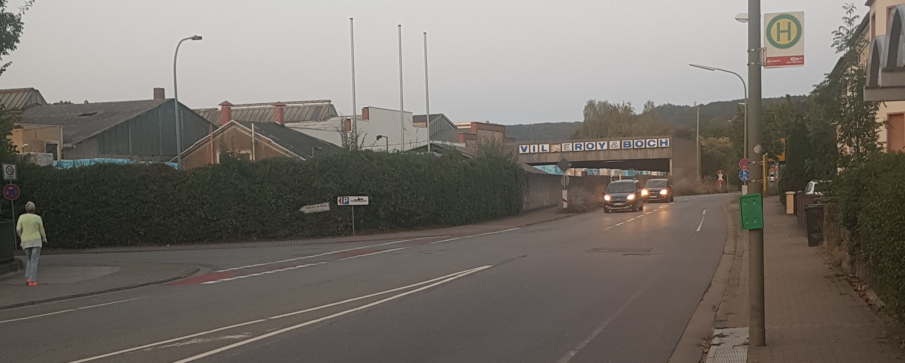

# Abzweig Torstraße-Fabrikstraße

Aus der Innenstadt kommend Richtung Brotdorf führt ein Radweg ab der Abzweigung Annastraße bis zum Bahnübergang an der Straße entlang.
Der ausgeschilderte Radweg Richtung Brotdorf/Losheim führt jedoch statt über die viel befahrene Losheimerstraße durch die Fabrikstraße, [Rotensteiner Weg und die Klinkerstraße](radweg_mzg-bd-rotenstein.md).
Um von dem Radweg in die Fabrikstraße abbiegen zu können, müssen beide Richtungsfahrbahnen überquert werden.

