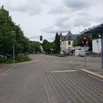

# Merzig Hbf

## Situation
Der Hausbahnsteig (Gleis 1) ist auf drei Wegen erreichbar (von Nord nach Süd):
1. über den Parkplatz
2. durch einen Durchgang unmittelbar neben der Treppe zur Unterführung
3. durch das Bahnhofsgebäude
Der Inselbahnsteig (Gleis 2 und 3) ist nur durch die Unterführung (Treppe oder Aufzug) vom Hausbahnsteig aus zu erreichen.

Von den Treppen zur Unterführung führt der kürzeste Weg zur Straße über der Busbahnof unmittelbar vor dem Bahnhof.
Die Alternative ist, das Fahrrad bis zum Parkplatz zu schieben (das können mehr als 150m sein), und von dort auf die Straße zu wechseln.
Das Befahren des Busbahnofs ist verboten für sämtliche Fahrzeuge außer Busse und Taxen.
Vom Bahnhof aus ist ein solches Verbot aber nicht zu erkennen, der Radfahrer fährt also im Busbahnhof.
An der Ausfahrt befindet sich eine Ampelanlage mit Induktionsschleife, die aber nicht auf Fahrräder reagiert.
D. h. Der Radfahrer ist genötigt die Ampel bei Rot zu passieren oder auf einen Bus, Taxi oder querenden Fußgänger zu warten.
Der Zustand des Fahrbahnbelags im Ampelbereich ist unzumutbar.

## Verbesserungsvorschläge:
- Ertüchtigung des Fahrbahnbelags
- Sensitivierung der Induktionsschleife oder Anforderungsknopf
- konsistente Beschilderung

[[Durchgang Bahnhof|media/20200918_081729.jpg]]
[[Panorama Busbahnhof|media/20200918_180742.jpg]]

