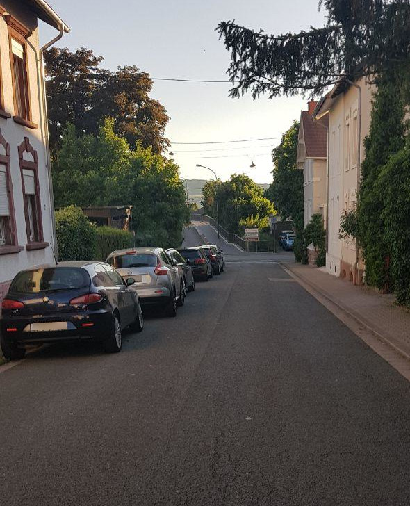
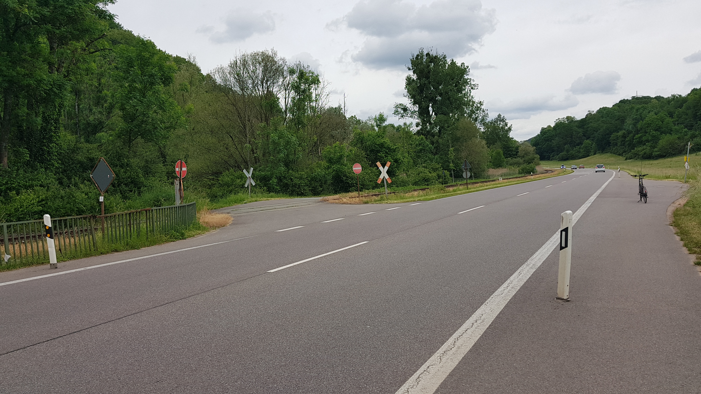

# Einbahnstraßen

Generell sind Einbahnstraßen für Radfahrer im Gegenverkehr freizugeben, wenn nicht besondere Gründe dagegen sprechen.

## Kernstadt
- Seminarstraße (50)
- Josefstraße
- Synagogenstraße (50)
- Neustraße (grösstenteils 30)
- Rieffstraße
- Schwarzenbergstraße (in diesem Abschnitt 50)
- Wagnerstraße (Verkehrsberuhigt)
- Pferdegasse (Verkehrsberuhigter Bereich)
- Beethovenstraße (50)
- Fischerstraße (Verkehrsberuhigt)
- Schankstraße
- Probsteistraße (in diesem Abschnitt verkehrsberuhigt)
- Zum Wiesenhof (Zone 30)
- Am Werthchen (Verkehrsberuhigter Bereich)
- Am Seffersbach (Verkehrsberuhigter Bereich)
- Brücke zwischen am Werthchen und am Seffersbach

|  |
| :---: |
| Seminarstraße |

Der Bereich um den Seffersbach in der Kernstadt (Am Werthchen, Am Viehmarkt, Trierer Straße) ist schon teilweise freigegeben.
Allerdings ist dort die Beschilderung inkonsistent, z. B. fehlt an vielen Hinweisschildern das Zusatzzeichen 1022-10.

## Brotdorf
- Schafbrücke (Klinkerstraße zur Provinzialstraße)
- Mettlacherstr. (Ab Hausbacher Straße bis Pfeifferstraße)

|  |
| :---: |
| Schafbrücke |

