# Einbahnstraßen

Generell sind Einbahnstraßen für Radfahrer im Gegenverkehr freizugeben, wenn nicht besondere Gründe dagegen sprechen.

<table>
  <thead>
    <tr>
      <th>Straße</th>
      <th>Tempolimit</th>
      <th>Kommentar</th>
    </tr>
  </thead>
  <tbody>
    <tr>
      <th colspan=3>Kernstadt</th>
    </tr><tr>
      <td>Seminarstraße</td>
      <td>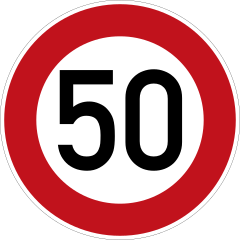</td>
      <td><a href="media/seminarstr.jpg">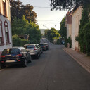</a></td>
    </tr><tr>
      <td>Josefstraße</td>
      <td></td>
      <td></td>
    </tr><tr>
      <td>Synagogenstraße</td>
      <td></td>
      <td>
        <a href="media/20200919_184031.jpg">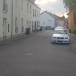</a>
      </td>
    </tr><tr>
      <td>Neustraße</td>
      <td>größtenteils 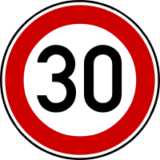</td>
      <td></td>
    </tr><tr>
      <td>Rieffstraße</td>
      <td></td>
      <td></td>
    </tr><tr>
      <td>Schwarzenbergstraße</td>
      <td>in diesem Abschnitt </td>
      <td>
        <a href="media/20200919_185036.jpg">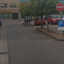</a>
      </td>
    </tr><tr>
      <td>Wagnerstraße</td>
      <td>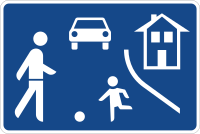</td>
      <td></td>
    </tr><tr>
      <td>Pferdegasse</td>
      <td></td>
      <td>
        <a href="media/20200919_183742.jpg">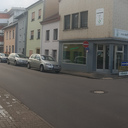</a>
        <a href="media/20200919_183919.jpg">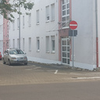</a>
        <a href="media/20200919_190127.jpg">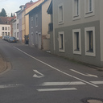</a>
      </td>
    </tr><tr>
      <td>Beethovenstraße</td>
      <td></td>
      <td></td>
    </tr><tr>
      <td>Fischerstraße</td>
      <td></td>
      <td></td>
    </tr><tr>
      <td>Schankstraße</td>
      <td></td>
      <td></td>
    </tr><tr>
      <td>Probsteistraße</td>
      <td>in diesem Abschnitt </td>
      <td>
        <a href="media/20200919_184515.jpg">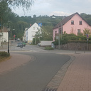</a>
      </td>
    </tr><tr>
      <td>Zum Wiesenhof</td>
      <td>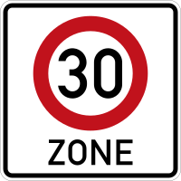</td>
      <td>
        <a href="media/20200919_181804.jpg">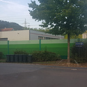</a>
      </td>
    </tr><tr>
      <td>Am Werthchen</td>
      <td></td>
      <td>
        
        
        
        
        
        
      </td>
    </tr><tr>
      <td>Am Seffersbach</td>
      <td></td>
      <td>
        <a href="media/20200919_183524.jpg">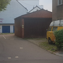</a>
      </td>
    </tr><tr>
      <th colspan=3>Brotdorf</th>
    </tr><tr>
      <td>Schafbrücke (Klinkerstraße zur Provinzialstraße)</td>
      <td></td>
      <td><a href="media/mzg-bd-einbahnstrasse-2.jpg">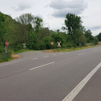</a></td>
    </tr><tr>
      <td>Mettlacherstr. (Ab Hausbacher Straße bis Pfeifferstraße)</td>
      <td></td>
      <td></td>
    </tr>
  </tbody>
</table>

Der Bereich um den Seffersbach in der Kernstadt (Am Werthchen, Am Viehmarkt, Trierer Straße) ist schon teilweise freigegeben.
Allerdings ist dort die Beschilderung inkonsistent, z. B. fehlt an vielen Hinweisschildern das Zusatzzeichen 1022-10.

