# Einbahnstraßen

Generell sind Einbahnstraßen für Radfahrer im Gegenverkehr freizugeben, wenn nicht besondere Gründe dagegen sprechen.
Die *Arbeitsgemeinschaft Fahrrad- und Fußgängerfreundlicher Kommunen in Baden-Würtemberg e. V.* (AGKF-BW) hat [dazu ein Faltblatt veröffentlicht](https://www.agfk-bw.de/fileadmin/user_upload/Projekte/Faktenblaetter/AGFK_BW_Faktenblatt_Einbahnstrassen.pdf).
[Eine Studie aus dem Jahr 2016 bzw. 2001](https://udv.de/de/file/9673/download?token=UtmWZLB1) der *Unfallforschung der Versicherer* hat einen positiven Effekt auf die Verkehrssicherheit festgestellt.

## Kernstadt

### Seminarstraße

<a href="media/20200919_181616.jpg">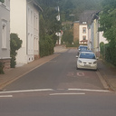</a>

### Josefstraße

<a href="media/20201003_123904.jpg">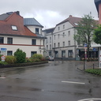</a>

### Synagogenstraße

### Neustraße
größtenteils .

### Rieffstraße

### Schwarzenbergstraße

In diesem Abschnitt .

### Wagnerstraße, Pferdegasse, Fischerstraße, Am Werthchen, Am Seffersbach

<a href="media/20200919_183017.jpg">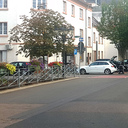</a>
<a href="media/20200919_183042.jpg">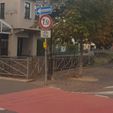</a>
<a href="media/20200919_183208.jpg">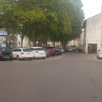</a>
<a href="media/20200919_183254.jpg">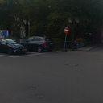</a>
<a href="media/20200919_183633.jpg">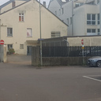</a>
<a href="media/20200919_183402.jpg">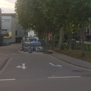</a>

Dieser Bereich ist bereits teilweise freigegeben, allerdings ist die Beschilderung inkonsistent: an vielen Schildern fehlt das Zusatzzeichen 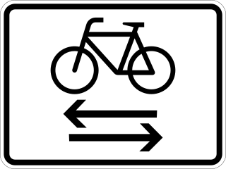 bzw. 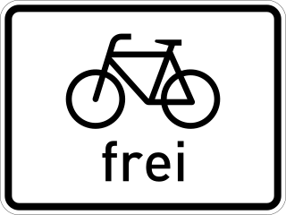.

### Beethovenstraße

<a href="media/20200919_181113.jpg">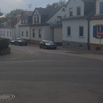</a>

### Schankstraße

### Probsteistraße
In diesem Abschnitt .

### Zum Wiesenhof

<a href="media/20200919_181535.jpg">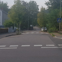</a>

Der Bereich ist bereits teilweise freigegeben, allerdings ist die Beschilderung inkonsistent.

## Brotdorf

### Schafbrücke 
Brücke aus der *Klinkerstraße* zur *L157*.

### Mettlacherstraße
Im Abschnitt ab *Hausbacher Straße* bis *Pfeifferstraße*

