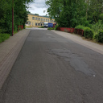
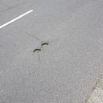
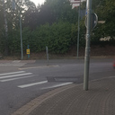
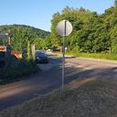

# Problemstellen

## Kreuzbergstraße
- Geschwindigkeitsbegrenzung 30 km/h
- teilweise Pflastersteine
- teilweise schlechter Zustand

Wichtig als Verlängerung des [Rotensteiner Wegs](radweg_mzg-bd-rotenstein.md) in die Innenstadt

## Bahnhofstraße/Schankstraße
Viele Schlaglöcher auf Höhe Hotel Restaurant Römer, diese Stelle ist auch schlecht beleuchtet.
Wichtig als Verbindung vom Hbf in die Innenstadt bzw. zurück.
[Bereits ausgebessert?]

## Propsteistraße
In der Kurve (`49°26'34.8"N 6°38'32.0"E`) befindet sich ein metallener Schachtdeckel, der bei Nässe sehr rutschig ist.
Es besteht hohes Verletzungsrisiko für ortsunkundige oder unaufmerksame Radler und auch Roller- oder Motorradfahrer.

## Bahnübergange
Die Stahlschienen sind bei Nässe glatt, dazu kommen noch die Spalten neben den Schienen.
Zusammengenommen stellen die Bahnübergänge in der Bahnhofstraße (`49°26'08.9"N 6°38'04.6"E`) und in der Losheimer Straße (`49°26'42.2"N 6°38'58.6"E`) ein hohes Verletzungsrisiko dar.
Wenn man den Bahnübergang als Radfahrer in einem sicheren, steileren Winkel überqueren möchte, muss man zwangsläufig in die Mitte der Fahrbahn ausscheren.

## Schlachthof
Vom Leinpfad (Saar-Radweg) unter der L174 hindurch, endet der Radweg abrupt an der Straße Zum Schlachtof.
Als Radfahrer Richtung Gymnasium am Stefansberg ist man gezwungen auf die Fahrbahn zu wechseln (`49°27'01.5"N 6°37'57.2"E`).
Wegen der oft zu hohen Geschwindigkeit der von der L174 abbiegender Fahrzeuge ist das recht gefährlich.

## Temporär aufgehobene Radwege

Der Radfahrer (oft auch der Fußgänger) hat im Umleitungsfall ist meistens sehr schlechte Karten.
Eine Führung durch die Baustelle ist meist nicht vorhanden, sodass der Radfahrer entweder im zu engen Bereich für Fußgänger fahren (eigentlich schieben) muss, oder auf die (meist verengte) Fahebahn wechseln muss.
In beiden Fällen kommt es häufig zu Konflikten.

Während des Umbaus des Hela-Kreisels zur Ampelkreuzung sollten z. B. die viel zu engen und mit Gittern begrenzten Fußgänger von Radfahrern mitbenutzt werden.
Viel bequemer und einfacher hätte man eine Rad-Umleitung über den Stadthallenparkplatz auf die Hilbringer Brücke mit sehr kleinem baulichen Aufwand einrichten können.

Weniger als eine Woche nach Freigabe der neuen Ampelkreuzung und der kombinierten umliegenden Rad-/Fußwege sind diese schon wieder wegen des Oktoberfestes gesperrt.

