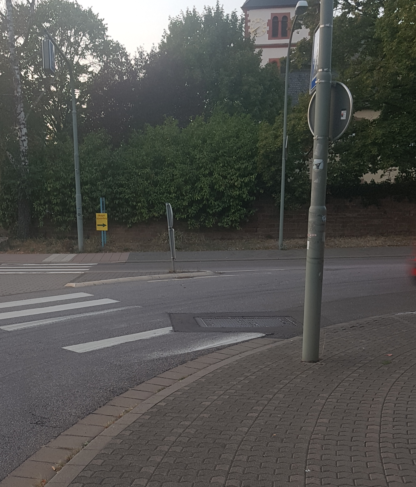
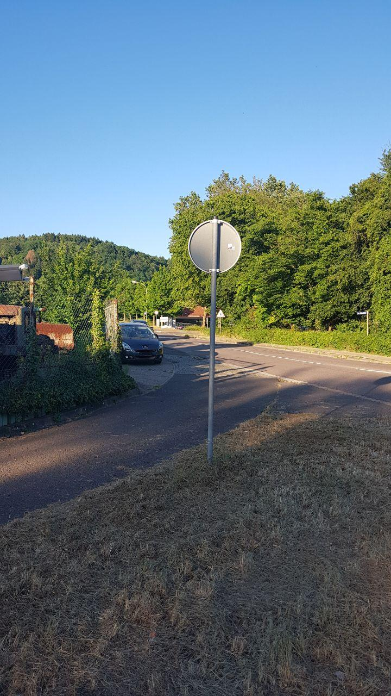

# Problemstellen

## Kreuzbergstraße
- Geschwindigkeitsbegrenzung 30 km/h
- teilweise Pflastersteine
- teilweise schlechter Zustand

Wichtig als Verlängerung des [Rotensteiner Wegs](radweg_mzg-bd-rotenstein.md) in die Innenstadt

## Bahnhofstraße/Schankstraße
Viele Schlaglöcher auf Höhe Hotel Restaurant Römer, diese Stelle ist auch schlecht beleuchtet.
Wichtig als Verbindung vom Hbf in die Innenstadt bzw. zurück.
[Bereits ausgebessert?]

## Propsteistraße
In der Kurve (`49°26'34.8"N 6°38'32.0"E`) befindet sich ein metallener Schachtdeckel, der bei Nässe sehr rutschig ist.
Es besteht hohes Verletzungsrisiko für ortsunkundige oder unaufmerksame Radler und auch Roller- oder Motorradfahrer.

## Bahnübergange
Die Stahlschienen sind bei Nässe glatt, dazu kommen noch die Spalten neben den Schienen.
Zusammengenommen stellen die Bahnübergänge in der Bahnhofstraße (`49°26'08.9"N 6°38'04.6"E`) und in der Losheimer Straße (`49°26'42.2"N 6°38'58.6"E`) ein hohes Verletzungsrisiko dar.
Wenn man den Bahnübergang als Radfahrer in einem sicheren, steileren Winkel überqueren möchte, muss man zwangsläufig in die Mitte der Fahrbahn ausscheren.

## Schlachthof
Vom Leinpfad (Saar-Radweg) unter der L174 hindurch, endet der Radweg abrupt an der Straße Zum Schlachtof.
Als Radfahrer Richtung Gymnasium am Stefansberg ist man gezwungen auf die Fahrbahn zu wechseln (`49°27'01.5"N 6°37'57.2"E`).
Wegen der oft zu hohen Geschwindigkeit der von der L174 abbiegender Fahrzeuge ist das recht gefährlich.

