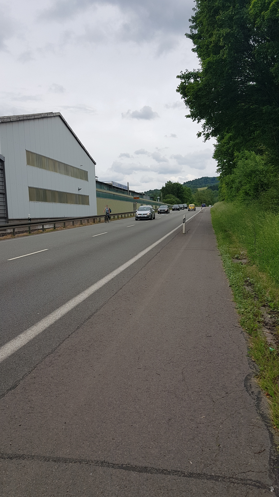
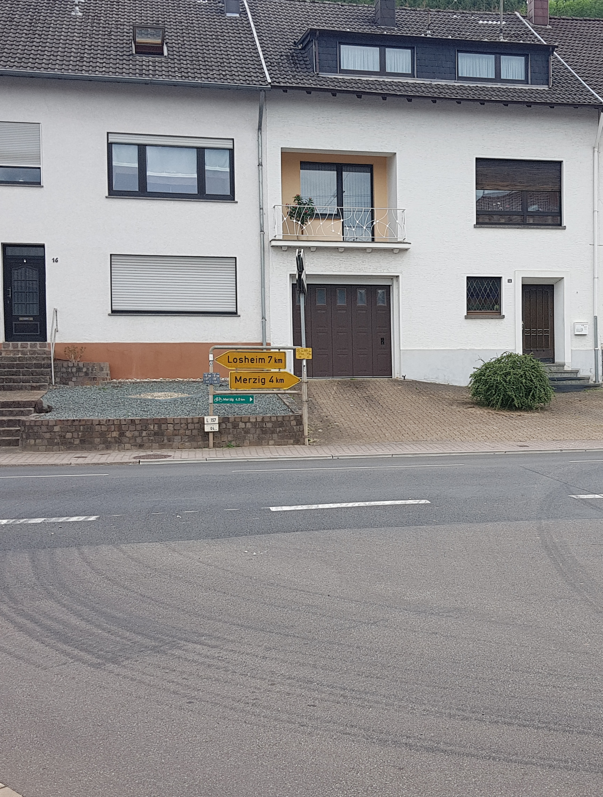

# Radweg Merzig-Brotdorf (L157)

## Situation
Zwischen Merzig und Brotdorf, entlang der L157, verlief einst ein Radweg (oder kombinierter Rad-/Fußweg).
Seit einigen Jahren endet der Rad-/Fußweg am Ortsausgang Merzig.

Was bleibt ist der Seitenstreifen, aber ohne Widmung als Fuß- oder Radweg.
Das Hinweisschild in Brotdorf (Abzweig Hausbacherstraße bei der Germania) blieb bestehen.

