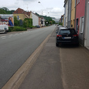

# Radweg Merzig-Brotdorf (L157)

## Situation
Zwischen Merzig und Brotdorf, entlang der L157, verlief einst ein Radweg (oder kombinierter Rad-/Fußweg).

Seit einigen Jahren endet der Rad-/Fußweg am Ortsausgang Merzig.

  
  

Was bleibt ist der Seitenstreifen, aber ohne Widmung als Fuß- oder Radweg.
Das Hinweisschild in Brotdorf (Abzweig Hausbacherstraße bei der Germania) blieb bestehen.
In Brotdorf ist der Weg in schlechtem Zustand, der Abzweig der L370 ist gefährlich und nicht Baulich oder durch Markierungen und Schilder gesichert.

  
  
  

In Merzig machen parkende Autos den Weg unzumutbar eng, der Zustand der Deckschicht ist schlecht.

  
  

## Verbesserungsvorschläge:

1. Ausbau
  - baulich getrennter Radweg außerorts (zumindest Leitplanke)
  - verbreiterung des jetztigen Seitenstreifens
  - Schutz am Abzweig L370 (baulich, durch Markierung und Beschilderung)
  - im Bereich Merzig: Halteverbot (mit konsequenter Durchsetzung) oder breitere Wege
  - im Bereich Brotdorf: Breitere Wege
2. Umleitung Rotenstein
  - konsistente Beschilderung

## Alternativ-Routen
- [Rotensteiner Weg / Klinkerstraße](radweg_bd-mzg-rotenstein.md)

