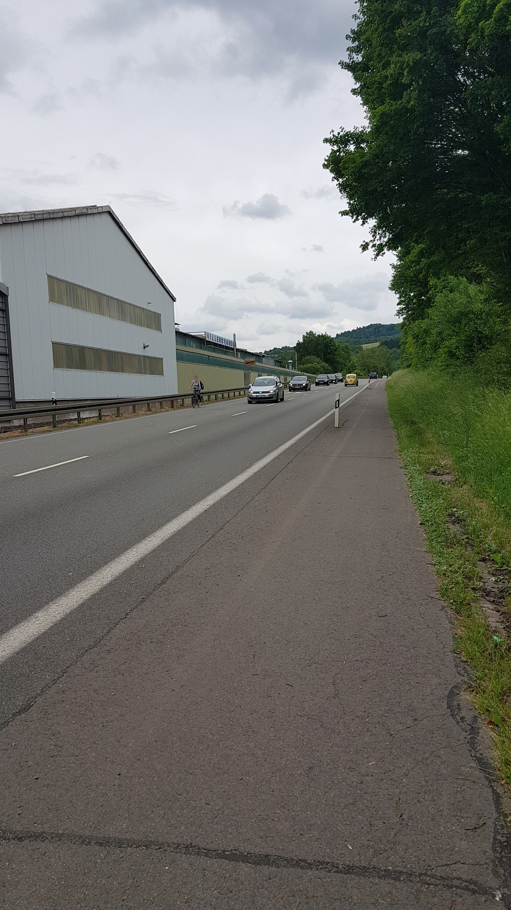
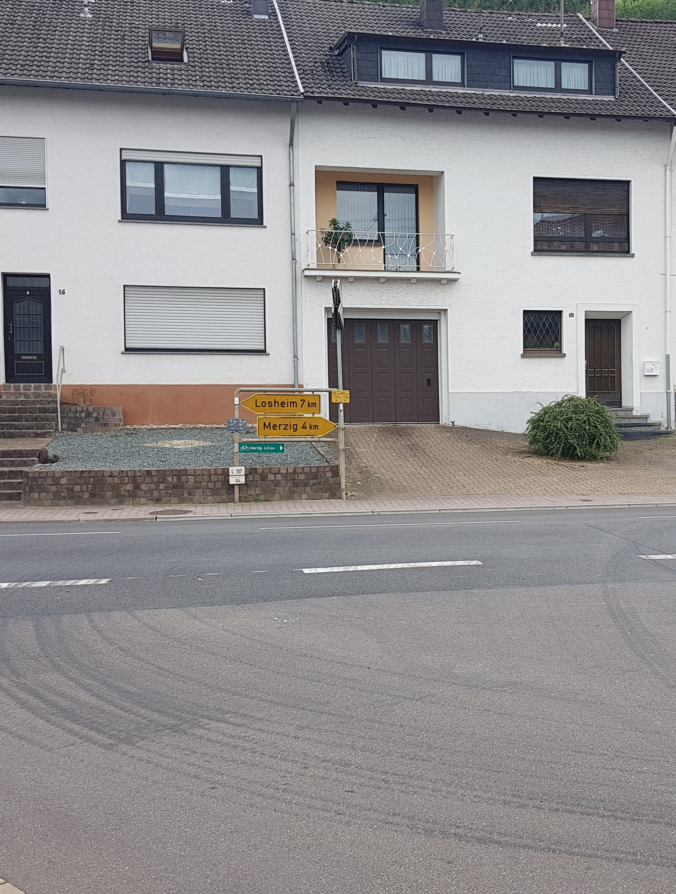

# Radweg Merzig-Brotdorf (L157)

## Situation
Zwischen Merzig und Brotdorf, entlang der L157, verlief einst ein Radweg (oder kombinierter Rad-/Fußweg).

Seit einigen Jahren endet der Rad-/Fußweg am Ortsausgang Merzig.

  
  

Was bleibt ist der Seitenstreifen, aber ohne Widmung als Fuß- oder Radweg.
Das Hinweisschild in Brotdorf (Abzweig Hausbacherstraße bei der Germania) blieb bestehen.
In Brotdorf ist der Weg in schlechtem Zustand, der Abzweig der L370 ist gefährlich und nicht Baulich oder durch Markierungen und Schilder gesichert.

  
  

  

In Merzig machen parkende Autos den Weg unzumutbar eng, der Zustand der Deckschicht ist schlecht.

  
  

## Verbesserungsvorschläge:
1. Ausbau
  - baulich getrennter Radweg Außerorts (zumindest Leitplanke)
  - Schutz am Abzweig L370
  - Halteverbot (mit konsequentem Durchsetzen) oder breitere Wege im Bereich Merzig
  - Breitere Wege im Bereich Brotdorf
2. Umleitung Rotenstein
  - konsistente Beschilderung

## Alternativ-Routen
- [Rotensteiner Weg / Klinkerstraße](radweg_bd-mzg-rotenstein.md)
