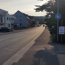

# Radweg Merzig-Hilbringen (L173)

## Hilbringen nach Merzig
Aktuell besteht von Hilbringen nach Merzig ein für Radfahrer freigegebener Fußweg.
Die Einmündungen (In der Acht, An der Tuchbleiche, Zur alten Saar, Tankstelle Kremer) sind unübersichtlich,
der Weg ist meist zugeparkt.

  
  
  
  

## Merzig nach Hilbringen
Der Radweg endet abrupt wenige Meter nach dem Ortseingang Hilbringen.
Engstelle an der Abzweigung Rehstr. (Beim König Kebab).

  
  

  

## Verbesserungsvorschläge

1. Ausbau
  - konsequente Durchsetzung des Halteverbots
  - Radfahrerschutz an Einmündungen, z.B. durch zwei Stoppschilder wie in Luxemburg (siehe unten) oder durch Markierungen

2. Ertüchtigung der Ausweichroute durch die Saarwiesen

## Alternativ-Routen

- [Saarwiesenring -- CEB -- Wiesenstr](saarwiesen.md)

