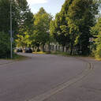

# Saarwiesen

## Verlauf
L173 -- Saarwiesenring -- In der Au -- Industrstraße -- Wiesenstraße -- (Merziger Straße / Rehstraße)

## Nuztung
Als Alternativroute zur [L173](radweg-mzg-hilbringen-l173.md) zwischen Merzig und Hilbringen und als Zubringer zum Freizeitpark in den Saarwiesen.

## Probleme
- keine Beleuchtung zwischen Autobahnunterführung und CEB
- Fahrbahndecke in miserablem Zustand
- zu eng bei gleichzeitiger Nutzung durch den Autoverkehr
- Kein Radweg

## Verbesserungsvorschläge:
- Beleuchtung (z.B. mit Bewegungsmelder?)
- für den Autoverkehr sperren (z.B. einzelner Poller vor der Autobahnunterführung)
- Fahrbahndecke erneuern

